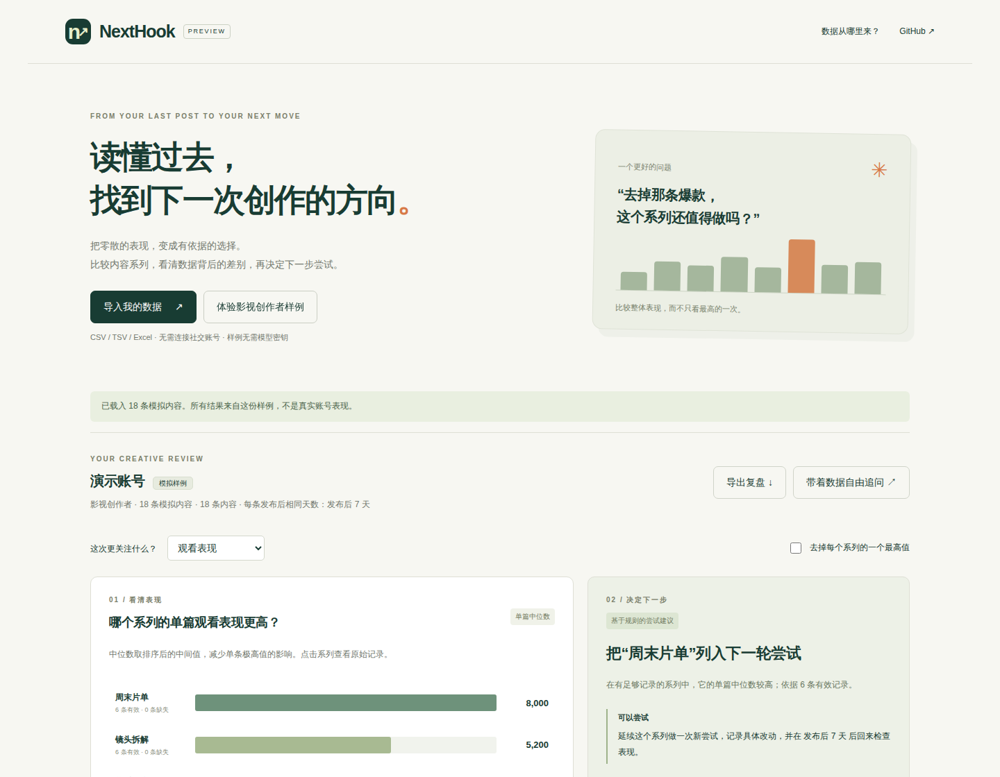

# Preview verification

Checked locally on 2026-10-04 with Node 22.22.3, Python 3.13.12 and Chromium through Playwright. The final browser run used the built application and real Python backend at 127.0.0.1:5571, with debug mode off and project-local runtime storage.

## Passed

- TypeScript: `node_modules/.bin/tsc --noEmit`.
- Production build: `TMPDIR=/tmp corepack yarn build`.
- 74 frontend tests across the creator calculations/import, workspace service, table-loading thunk, Excel cell conversion and type inference.
- 5 retained backend tests for Flask session configuration.
- 5 browser tests: synthetic comparison and sensitivity, series editing and plan persistence; CSV mapping and window restrictions; guide and mobile overflow; actual table upload into the upstream workbench with row content restored after refresh; Excel import with a blank cell and an explicit zero preserved separately.

Reproduce the focused frontend suite:

```bash
TMPDIR=/tmp node_modules/.bin/vitest run tests/frontend/nexthook.test.ts tests/frontend/unit/app/workspaceService.test.ts tests/frontend/unit/app/tableThunks.test.ts tests/frontend/unit/data/resolveExcelCellValue.test.ts tests/frontend/unit/data/typeInference.test.ts
TMPDIR=/tmp .venv/bin/python -m pytest tests/backend/auth/test_flask_session_config.py -q
```

Run `corepack yarn test:e2e` with the server running and Playwright Chromium installed. See README.md for startup commands. Browser checks use generated test files and simulated creator content, not private account records.

## Practical limits

- No live model credentials or inference were exercised. The upstream model-selection screen appears until a model is configured; copying a prepared question is not an AI response.
- No native platform export was authenticated or imported. Generic CSV and Excel behavior was tested, not platform-specific schemas. Consult platform-data-sources.md before promising compatibility.
- This is a local preview, not a deployed multi-user service. No full upstream regression suite, load test or accessibility audit was run.
- The retained upstream bundle is large; Vite reports chunk-size and dependency warnings. Build succeeds, but initial-load optimization remains future work.
- Existing upstream README whitespace is retained as part of the original document. New creator files passed the staged whitespace check.


